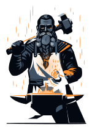

<p align="center">
  
</p>

<h1 align="center">Brokk</h1>

<p align="center"><strong>CCL's open-source AI coding-agent platform — the forge.</strong></p>

Brokk is the **code** pillar of the CCL triad:

| | Pillar | Does |
|---|---|---|
| **Hauldr** | data | multi-tenant BaaS / Postgres |
| **Heimdall** | deploy | control plane over Coolify |
| **Brokk** | **code** | **card → agent forges code → Pull Request** |

> Private first; **Apache-2.0** once hardened.

## How it works
A card (issue) goes on the board → a **runner** picks it up → spins an isolated git
worktree → runs the **Claude Agent SDK** (headless) to forge the change → commits,
pushes, and opens a **PR**. Many runners pull from one queue, in parallel.

Brokk is the **shell** (board, queue, runner orchestration, GitHub/PR) — the **brain
is the Claude Agent SDK**. It composes with **headroom** (context compression) by
routing the agent through a proxy (`ANTHROPIC_BASE_URL`).

## Stack
pnpm monorepo · **Hono** API · **Next 15** web · **Drizzle + Postgres**. (Same mold as Heimdall OSS.)

```
apps/api      @brokk/api      Hono control plane (tasks, queue, runs, webhooks)
apps/web      @brokk/web      Next 15 kanban board
packages/core @brokk/core     domain types + ports (AgentEngine, GitProvider)
packages/db   @brokk/db       Drizzle schema + Postgres store
packages/runner @brokk/runner Claude Agent SDK runner (worktrees, gh) — runs on a worker host
packages/sdk  @brokk/sdk      typed API client
```

## Quickstart (dev)
```bash
pnpm install
cp .env.example .env          # set BROKK_DATABASE_URL, BROKK_RUNNER_SECRET, GITHUB_TOKEN, ...
pnpm --filter @brokk/db db:push   # create schema
pnpm dev                      # api + web
# in a worker host (with git, gh, claude, headroom):
pnpm --filter @brokk/runner start
```

## Auth & billing
The agent authenticates as either:
- **`subscription`** (default) — a lent Claude **Max** seat (`claude setup-token` → sealed `CLAUDE_CODE_OAUTH_TOKEN`), routed through headroom to stretch the Max rate-limit window. CCL's internal mode. ⚠️ Server-side automation on a consumer subscription is ToS-gray and shares that seat's interactive rate-limit window.
- **`api_key`** — `ANTHROPIC_API_KEY` via the CCL AI gateway (central spend + headroom $-saving compression). The path for multi-tenant / public self-host; **deferred** while Brokk is internal.

## Deploy (self-host)
The whole platform is containers — `docker compose up` and you have the board;
add `--profile forge` and you have the workers.

```bash
cp .env.example .env          # set POSTGRES_PASSWORD, BROKK_RUNNER_SECRET, ANTHROPIC_API_KEY, …
docker compose up -d                  # board: Postgres + API + Next web, behind Traefik (:80)
docker compose --profile forge up -d  # + runner (forge) + eitri (PR review) + gateway (previews)
```

Only `web` is public, fronted by **Traefik**; the browser reaches the API through
same-origin Next rewrites. Override the entrypoint port with `BROKK_HTTP_PORT` and
the host match with `BROKK_TRAEFIK_RULE='Host(\`brokk.example.com\`)'`.

**Zero-downtime releases.** `web` runs with no fixed name or host port, so a deploy
can momentarily scale it to two replicas; Traefik load-balances across them and only
routes to **healthy** containers. Roll a new build out without dropping a request:

```bash
scripts/rolling-deploy.sh web     # build → boot new replica → health-gate → drain old
```

It builds the new image, brings a second replica up beside the live one, waits for its
healthcheck, then drains and removes the old one (and rolls back automatically if the
new replica never goes healthy).

**The forge worker** (`runner`) ships with `git`, `gh`, and the Claude Code CLI. To let
the agent *build and run* a target repo, mount the host Docker socket (it launches builds
as sibling containers — "Docker-out-of-Docker"); see the commented block in
`docker-compose.yml`. That's root-equivalent on the host, so it's single-tenant self-host
only — multi-tenant wants rootless/microVM isolation.

> CCL runs this on Coolify (a Docker Compose resource → `web` routed at
> `brokk.coldcodelabs.com`); any orchestrator with healthcheck-aware rolling works the same.

## Status
**Operational (internal).** The full loop runs end-to-end: a card → the planner fans it
into a DAG of cards → a runner forges each in an isolated worktree → opens a PR; **Eitri**
reviews every PR (semgrep + trivy + LLM) and a webhook closes the plan on merge. Brokk runs
in production on **surtr** — container-first, blue/green `web` behind Traefik — and powers
an on-demand **dev preview lane** (`*.preview.coldcodelabs.com`). Still private; Apache-2.0
once hardened. See [ARCHITECTURE.md](./ARCHITECTURE.md) for the design and roadmap.


